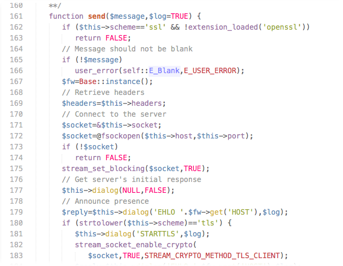
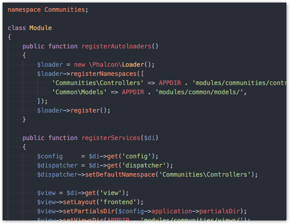

# Dimmed Color collection

[Sublime Text 2/3] (http://uonick.ru/dimmed/)

[PHP Storm] (http://uonick.ru/dimmed-phpstorm/)

[Atom](http://uonick.ru/dimmed-dark-ocean-syntax/)

- [x] Dark themes
- [x] Light themes
- [x] Sepia themes

[Test themes] (http://tmtheme-editor.herokuapp.com/#!/editor/theme/Dimmed)

[Download .ZIP] (https://github.com/uonick/dimmed/zipball/master)

[Website] (http://uonick.github.io/dimmed/)

## Screenshots

### Dimmed

### Dimmed OneDark

### Dimmed Gitlab

### Dimmed Spacegray

### Dimmed Phalcon

### Dimmed Fluid

### Dimmed Base16

### Dimmed Monokai

### Dimmed Storm

### Dimmed No Contrast

### Dimmed No Contrast v2

### Dimmed Night

## Install

**With the Package Control plugin:** The easiest way to install Dimmed Theme is through Package Control, which can be found at this site: [Package Control] (https://sublime.wbond.net/installation)

Once you install Package Control, restart ST2 and bring up the Command Palette (`Command+Shift+P` on OS X, `Control+Shift+P` on Linux/Windows). Select "Package Control: Install Package", wait while Package Control fetches the latest package list, then select `Dimmed`  when the list appears. The advantage of using this method is that Package Control will automatically keep Dimmed Theme up to date with the latest version.

## Manual Install (not recommended)

* Download  [zip file]  (https://github.com/uonick/dimmed/zipball/master) from github
 or from [TmTheme Editor Gallery] (http://tmtheme-editor.herokuapp.com/#/theme/Dimmed) or [Colorsublime] (http://colorsublime.com/?q=dimmed)
* Extract to:

* OS X:

        ~/Library/Application Support/Sublime Text 2/Packages/User/Dimmed

* Linux:

        ~/.config/sublime-text-2/Packages/User/Dimmed

* Windows:

        %APPDATA%\Sublime Text 2\Packages\User\Dimmed

* Select theme from `Preferences -> Color Scheme -> Dimmed Color Scheme -> dimmed or dimmed-monokai`

## Links

[Download .ZIP] (https://github.com/uonick/dimmed/zipball/master)

[Website] (http://uonick.github.io/dimmed/)

